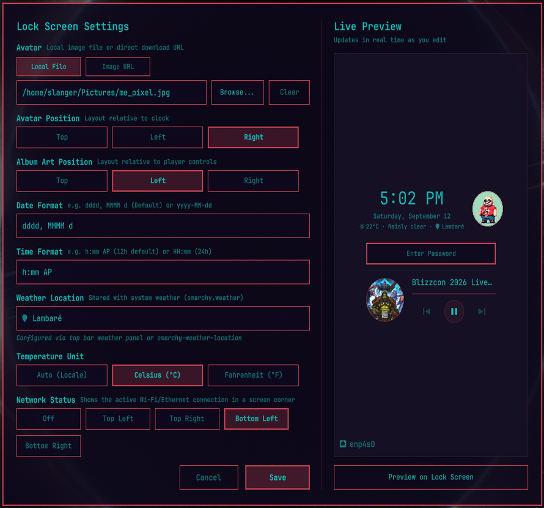

# OmaLock - Minimalist Lock Screen for Omarchy

A Quickshell lock screen plugin for Omarchy that replaces the stock password-only prompt with a minimalist, theme-aware screen: clock, weather, an optional avatar, now-playing media controls for any MPRIS-compatible player, and network status — all positionable and configurable from a built-in settings panel, without touching PAM or fingerprint authentication.

> **Disclaimer:** *This project is an unofficial community plugin for Omarchy. It is not
> developed by, endorsed by, or officially connected to Omarchy, Spotify AB, Google (YouTube
> Music), or any other media player or player vendor it may interoperate with via the standard
> MPRIS D-Bus interface.*

<p align="center">
  
</p>

## Features

- **Clock**: large, theme-colored clock with a configurable date/time format string, updated every second.
- **Weather**: shares the exact same location source as Omarchy's own `omarchy.weather` bar widget (`~/.local/state/omarchy/settings/weather.json`, set via the weather bar widget or `omarchy-weather-location`). Uses Open-Meteo when coordinates are configured (fast) and falls back to wttr.in (by name or IP auto-detection) otherwise. Shows the resolved city name with a map-marker icon. Fails silently (hides itself) with no network.
- **Avatar**: circular avatar image, selectable from a local file or a direct image URL (downloaded and cached locally, never re-fetched at lock time). Position: top, left, or right of the clock.
- **Now Playing**: works with any MPRIS-compatible media player — Spotify, a YouTube Music PWA/browser extension that exposes MPRIS, VLC, mpv, Rhythmbox, and others — shown only while a session is active (hidden entirely otherwise). Track title/artist, a live progress bar, Play/Pause/Next/Previous controls (via the stock Omarchy MPRIS media service — no `playerctl` dependency), and the active player's real album art (cached locally, circular, with a generic music-note glyph fallback when no art is available). Album art position: top, left, or right of the controls.
- **Network Status**: shows the active Wi-Fi (SSID + signal-strength icon, same thresholds as Omarchy's own network widget) or Ethernet (interface name) connection. Hidden when offline. Placeable in any screen corner.
- **Theme-aware**: every color comes from the active Omarchy theme's `Color.lock.*` tokens — no hardcoded palette, no new theme files required.
- **Settings Panel**: a dedicated in-shell settings window (menu: **Style → Omalock**, or `omarchy-shell asdfsnlr.omalock openSettings`) with a live preview pane that updates as you type, before you save.

## Requirements & External Dependencies

- **Omarchy Linux** (Quickshell-based shell with plugin support).
- **`curl`** — used for weather (wttr.in / Open-Meteo), avatar-by-URL downloads, and album art downloads from the active MPRIS player. Ships with a stock Omarchy install.
- **`zenity`** — optional, only used by the Settings panel's "Browse..." local file picker for the avatar. If absent, avatars can still be set by pasting a local path or an image URL directly.
- **NetworkManager**, via Quickshell's built-in `Quickshell.Networking` module — required for the Network Status widget to detect Wi-Fi/Ethernet state. This is Omarchy's default network backend, so no extra setup is needed on a stock install.
- **`jq`** — only needed for the optional `omalock` CLI tool (`bin/omalock`); the lock screen itself doesn't use it.
- No Python, Node.js runtime, or other language dependency is required at runtime (a `node` binary is only used once, optionally, by `install.sh` to register the menu entry — the plugin itself needs nothing beyond Quickshell/QML).

## Installation

**Recommended:** clone the repo and run the bundled installer — it registers and enables the plugin, adds the **Style → Omalock** menu entry, and links the `omalock` CLI into `~/.local/bin`:

```bash
git clone https://github.com/asdfsnlr/omalock.git
cd omalock
./install.sh
```

Or add and enable the plugin directly, without cloning — this skips the menu entry and the CLI symlink, so use `install.sh` afterwards (from anywhere the repo is available) if you want those too:

```bash
omarchy plugin add https://github.com/asdfsnlr/omalock.git --enable
```

Or install and enable locally for development:

```bash
mkdir -p ~/.config/omarchy/plugins
cp -r "$PWD" ~/.config/omarchy/plugins/asdfsnlr.omalock
omarchy plugin enable asdfsnlr.omalock
```

## Removal

```bash
# Disable without uninstalling
omarchy plugin disable asdfsnlr.omalock

# Remove the plugin
omarchy plugin remove asdfsnlr.omalock
```

Or remove manually if installed locally:

```bash
omarchy plugin disable asdfsnlr.omalock
rm -rf ~/.config/omarchy/plugins/asdfsnlr.omalock
```

Removing the plugin does not touch PAM/fingerprint configuration or any other Omarchy settings — Omarchy falls back to its own stock lock screen once this plugin is disabled or removed.

## Configuration

All settings are stored in `~/.config/omalock/settings.json` — separate from the plugin's own source directory, so a plugin update never touches it — and are edited from the in-shell **Settings** panel; there is no manual JSON editing required. (An existing install that still has a `settings.json` under the old `~/.config/omarchy/plugins/<id>/` location is migrated automatically, once, the first time this version loads.)

- **Avatar**: local file path or image URL, and position (Top / Left / Right).
- **Album Art Position**: Top / Left / Right, relative to the now-playing controls.
- **Date Format** / **Time Format**: `Qt.formatDate` / `Qt.formatTime` pattern strings (e.g. `dddd, MMMM d`, `h:mm AP`).
- **Weather Location**: read-only in this plugin — it mirrors whatever location is configured for the system's own weather widget (`omarchy-weather-location` or the weather bar widget's own location editor), so both stay in sync automatically.
- **Temperature Unit**: Auto (locale-based) / Celsius / Fahrenheit.
- **Network Status**: Off, or a screen corner (Top Left / Top Right / Bottom Left / Bottom Right).

Open the settings panel from the Omarchy menu (**Super** key → **Style** → **Omalock**), or run:

```bash
omarchy-shell asdfsnlr.omalock openSettings
```

Preview any change against the real lock screen without saving, using the **Preview on Lock Screen** button in the settings panel, or:

```bash
omarchy-shell lock preview
```

## CLI Usage

The plugin includes a standalone `omalock` CLI (`bin/omalock`, pure bash — needs only `jq`) that reads and writes the exact same `~/.config/omalock/settings.json` the Settings panel uses, so a change from the terminal takes effect immediately (no restart needed). `./install.sh` symlinks it into `~/.local/bin/omalock` automatically; otherwise run it as `~/.config/omarchy/plugins/<id>/bin/omalock`.

```bash
# Show all current settings as JSON
omalock list

# Print the value of a single setting
omalock get avatarPosition

# Set a setting (validated against the same choices as the Settings panel)
omalock set avatarPosition left
omalock set albumArtPosition right
omalock set weatherUnit metric
omalock set networkWidgetPosition top-right
omalock set dateFormat "yyyy-MM-dd"
omalock set timeFormat "HH:mm"
omalock set avatarPath "$HOME/Pictures/avatar.png"

# Open the in-shell Settings panel / preview the lock screen
omalock open
omalock preview

# Full command and key reference
omalock help
```

`weatherLocation` isn't set through the CLI (or the Settings panel) — it follows Omarchy's own weather widget; use `omarchy-weather-location` to change it.

## Data & Privacy

- Weather requests go to `wttr.in` and `api.open-meteo.com` (no API key, no account); location is whatever is already configured for Omarchy's own weather widget.
- Avatar/album-art URLs are downloaded once via `curl` and cached locally under `~/.config/omalock/` — nothing is re-fetched at lock time, and no raw URLs are persisted, only the local cache path.
- Track/artist/art metadata comes entirely from the local MPRIS session of whatever player is active (via Omarchy's own stock media service) — nothing is sent anywhere.
- No user configuration outside `~/.config/omalock/settings.json` is ever written to. The plugin reads (never writes) the shared system weather location file.

## Running Checks

```bash
# Lint QML syntax
qmllint -I /usr/share/omarchy/shell ./*.qml ./ui/*.qml

# Validate manifest schema
omarchy plugin validate .
```

## License

This project is licensed under the MIT License. See [LICENSE](LICENSE) for details.
